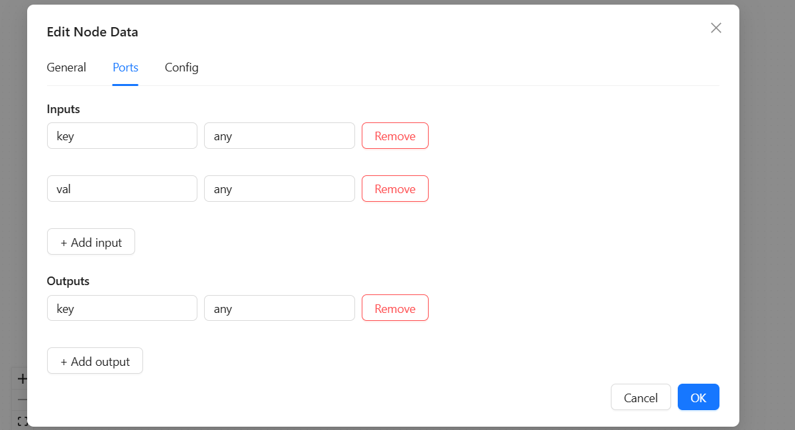
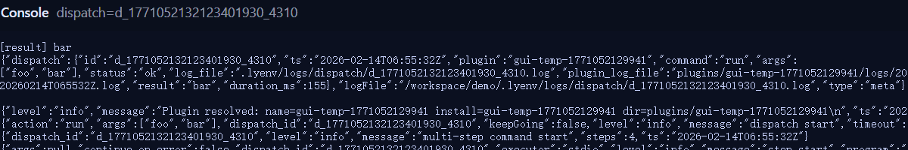

# lyenv 贡献指南（GUI 工作流 + 插件）

欢迎你为 **lyenv** 贡献插件/工作流！

本文档重点讲清楚：
- GUI 中节点之间的数据流（端口 + 连线）
- **统一的 Hybrid Node Runtime**（业务节点与 stdio 节点统一）
- 一个可以完全复现的案例：**KV Set → KV Get**
- 如何导出插件并发布到插件中心


---

## 0）核心概念（先看这个）

### 0.1 工作流模型
- **工作流 = 插件**
- **Group = 命令**
- **节点 = 执行步骤**
- **连线 = 数据依赖**

### 0.2 数据流模型（最重要）
节点通过 **端口** 交换数据：

- **输出端口（outputs）** 产生值
- **输入端口（inputs）** 消费值
- 一条连线表示：  
  `上游输出端口 → 下游输入端口`

运行时数据存放在 flow “总线”里：

```
flow.outputs.<node_id>.<port_name>
```

GUI 导出器会生成 wiring 文件 `flow_wiring.json`，用于把下游输入映射到上游输出。



---

## 1）环境准备（一次性）

创建环境：

```bash
lyenv create ./demo
lyenv init ./demo
cd ./demo
```

激活：

- **Linux/macOS**：
  ```bash
  eval "$(lyenv activate)"
  ```
- **Windows PowerShell**：
  ```powershell
  lyenv activate | Invoke-Expression
  ```

启动 GUI 并注册 env：

```bash
lyenv gui start --open
lyenv gui add . --name=demo
```

---

## 2）Hybrid Node Runtime（你现在最重要的能力）

lyenv GUI 使用 **Hybrid Node Runtime**，让节点作者可以选择两种写法（但节点类型不需要分裂）。

### 2.1 简单写法（推荐，80% 节点）

- 输入来自 `argv`（顺序=输入端口顺序）
- 输出写到 `stdout`
- 多输出建议输出 JSON 数组：`["o1","o2"]`

示例（`simple_node.py`）：

```python
import sys, json
a = sys.argv[1] if len(sys.argv) > 1 else ""
b = sys.argv[2] if len(sys.argv) > 2 else ""
print(json.dumps([a.upper(), b.lower()], ensure_ascii=False))
```

### 2.2 高级写法（需要配置/变更/产物/日志时）

- 可以在节点脚本里调用 `read_request()`
- 可以使用 `mutate` / `config_plugin` / `emit_artifact` / `log`
- 可以返回 stdio JSON（`respond_ok` / `respond_error`）
- 推荐用 `outputs` 显式提供端口输出：

```python
respond_ok("", extra={"outputs": ["out1", "out2"]})
```

**原理**：runner 会把 request JSON 转发到子进程 stdin，并自动合并子进程的 stdio 响应。

---

## 3）完整案例：KV Set → KV Get（体现数据传递 + 配置读写）

**目标**：

- 输入 `key val`
- 写入插件配置：`kv.<key> = <val>`
- 读取 `kv.<key>` 并打印出来

期望输出：`bar`

### 3.1 画布结构

创建节点：

- `Start`
- `WriteKV`（Python code）
- `ReadKV`（Python code）
- `End`


### 3.2 端口定义

- **Start**  
  outputs：`key`, `val`

- **WriteKV**  
  inputs：`key`, `val`  
  outputs：`key`

- **ReadKV**  
  inputs：`key`  
  outputs：`val`

- **End**  
  inputs：`val`

### 3.3 连线（wiring）

- `Start.key` → `WriteKV.key`
- `Start.val` → `WriteKV.val`
- `WriteKV.key` → `ReadKV.key`
- `ReadKV.val` → `End.val`


### 3.4 节点代码（直接复制）

#### 3.4.1 WriteKV（Python）

写入 `kv.<key>=<val>` 并输出 `key`：

```python
import sys
from lyenv_sdk import read_request, mutate, respond_ok, respond_error, log

def main():
    read_request()

    key = sys.argv[1] if len(sys.argv) > 1 else ""
    val = sys.argv[2] if len(sys.argv) > 2 else ""
    key = key.strip()

    if not key:
        respond_error("empty key")
        return

    mutate(f"kv.{key}", val, scope="plugin")
    log(f"write kv.{key}={val}")

    respond_ok("", extra={"outputs": [key]})

if __name__ == "__main__":
    main()
```

#### 3.4.2 ReadKV（Python）

读取 `kv.<key>` 并输出 `val`：

```python
import sys
from lyenv_sdk import read_request, config_plugin, respond_ok, respond_error, log

def main():
    read_request()

    key = sys.argv[1] if len(sys.argv) > 1 else ""
    key = key.strip()
    if not key:
        respond_error("empty key")
        return

    val = config_plugin(f"kv.{key}", "")
    log(f"read kv.{key}={val}")

    respond_ok("", extra={"outputs": [str(val)]})

if __name__ == "__main__":
    main()
```

### 3.5 GUI 运行

点击 **Run**，输入参数：`foo bar`

最终输出应为：`bar`



---

## 4）多输出写法（强烈推荐）

如果节点有输出端口：`a`, `b`, `c`  
推荐输出 JSON 数组（不怕空格，不会 split 误拆）：

```python
import json
print(json.dumps(["A","B","C"], ensure_ascii=False))
```

---

## 5）导出为插件并用 CLI 验证

导出插件后本地安装：

```bash
lyenv plugin add /path/to/exported-plugin --name=myflow
```

CLI 运行：

```bash
lyenv run myflow run -- foo bar
```

---

## 6）发布到插件中心（Release assets 模式）

✅ **只提交源码**：

```
plugins/<NAME>/
  manifest.yaml
  scripts/
  config.yaml（可选）
```

❌ **不提交 zip**。

**流程**：

1. fork 插件中心仓库
2. 添加/修改 `plugins/<NAME>/...`
3. 更新版本号
4. 提 PR 到 `main`

合并后 CI 自动打包 zip、上传 Release（tag=`artifacts`）、更新 `index.yaml` 并开 PR。合并 index PR 即发布。

---

## 7）常见问题排查

### 7.1 下游拿到空值

- 最常见：没有连线
- 确认：上游输出 → 下游输入 连接存在

### 7.2 输入不对/看起来乱

- 确认端口名字与连线一致
- 一个输入端口只应有一条入线

### 7.3 需要访问配置/写 mutation

- Hybrid runtime 下可以安全调用 `read_request()`
- 用 `mutate` / `config_plugin` / `log` / `respond_ok(extra={"outputs":[...]})`

---

感谢你的贡献 🚀